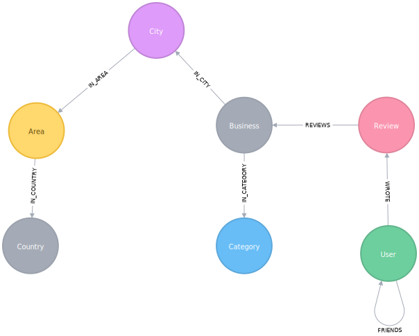

= Applied Graph Algorithms Training

== About this course

Graph algorithms are used to compute metrics for graphs, nodes, or relationships.
They can provide insights on relevant entities (centralities, ranking) in the graph or inherent structures such as communities (community-detection, graph-partitioning, clustering).
In this course you will learn how to use Neo4j's Graph Algorithms library to enhance your graph based applications.

== Yelp Dataset

We will be using data from the https://www.yelp.com/dataset/challenge[Yelp Dataset Challenge^].
_Add a few sentences explaining the dataset_

*Put something here for them to click through so we can approve the use of the dataset*

== Graph Model

This is the graph model that we'll be working with:

== Cypher Refresher

Let's do some exploratory analysis to get a feel for the data.

We'll start by seeing which cities have the most reviews:

[source,cypher]
----
include::queries.cql[tag=most-reviewed-cities]
----

Las Vegas, Phoenix, and Toronto have the majority of reviews so we'll use one of those so that we have plenty of data to work with.
We'll use Phoenix because $REASONS.

We can find the most reviewed restaurants in Phoenix by executing the following query:

[source,cypher]
----
include::queries.cql[tag=most-reviewed-restaurants]
----

And who are some interesting people?

[source,cypher]
----
include::queries.cql[tag=interesting-reviewers]
----

Set the `userIds` parameter

[source,cypher]
----
include::queries.cql[tag=userids]
----

[source,cypher]
----
include::queries.cql[tag=selected-users]
----

Now that we're familiar with the data we're going to build our own Yelp application based on it.

== Graph Algorithms

We have 4 types of graph algorithms:

* Path Finding
* Centrality
* Community Detection
* Similarity

The first 3 are classic graph algorithms and the 4th can be used on its own or in combination with the other 3.

== Part 1: Category Hierarchy

In this section we'll learn how to use the Overlap Similarity algorithm to navigate categories.

We start with a list of 100 random categories but no relationships between them.

Now let's run the algorithm:

[source,cypher]
----
include::queries.cql[tag=compute-taxonomy-template]
----

And this is the answer:

[source,cypher]
----
include::queries.cql[tag=compute-taxonomy]
----

Now let's remove any transitive relationships that the algorithm's created.
Run the following query:

[source,cypher]
----
include::queries.cql[tag=transitive-taxonomy]
----

Now that we've computed relationships between categories, let's update the application to only return top level categories.

NOTE: Top level categories don't have an outgoing `NARROWER_THAN` relationship.

== Part 2: Ordering search results

In this section we'll learn how to use the Pearson Similarity algorithm to recommend reviews based on user similarity.

[source,cypher]
----
include::queries.cql[tag=topk-similar-users-template]
----

And here's the answer:

[source,cypher]
----
include::queries.cql[tag=topk-similar-users]
----

== Part 3: Most relevant reviews

In this section we'll learn how to use the Personalized PageRank algorithm to return relevant businesses in search results.

== Part 4: Photo based gallery recomendations

In this section we'll learn how to use the Label Propagation algorithm to recommend photos.
