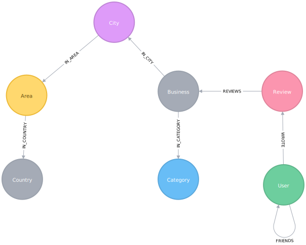

= Applied Graph Algorithms Training

== About this course

Graph algorithms are used to compute metrics for graphs, nodes, or relationships.
They can provide insights on relevant entities (centralities, ranking) in the graph or inherent structures such as communities (community-detection, graph-partitioning, clustering).
In this course you will learn how to use Neo4j's Graph Algorithms library to enhance your graph based applications.

== Yelp Dataset

https://www.yelp.com/[Yelp^] helps people find local businesses based on reviews, preferences, and recommendations.
Over 163 million reviews have been written on the platform as of the middle of 2018.
Yelp has been running the Yelp Dataset challenge 2 since 2013, a competition that encourages people to explore and research Yelp’s open dataset.

As of Round 12 of the challenge, the open dataset contained:

* Over 7 million reviews plus tips
* Over 1.5 million users and 280,000 pictures
* Over 188,000 businesses with 1.4 million attributes
* 10 metropolitan areas

The https://www.yelp.com/dataset/challenge[Yelp dataset^] represents real data that is very well structured and highly interconnected.
It’s a great showcase for graph algorithms that you can also download and explore.

*Put something here for them to click through so we can approve the use of the dataset*

== Graph Model

This is the graph model that we'll be working with:

== Cypher Refresher

Let's do some exploratory analysis to get a feel for the data.

We'll start by seeing which cities have the most reviews:

[source,cypher]
----
MATCH (c:City)
RETURN c.name, size((c)<-[:IN_CITY]-()) AS numberOfReviews
ORDER BY numberOfReviews DESC
LIMIT 10;
----

Las Vegas, Phoenix, and Toronto have the majority of reviews so we'll use one of those so that we have plenty of data to work with.
We'll use Phoenix because $REASONS.

We can find the most reviewed restaurants in Phoenix by executing the following query:

[source,cypher]
----
match (b:Business)-[:IN_CITY]->(:City {name: "Phoenix"})
WHERE (b)-[:IN_CATEGORY]->(:Category {name: "Restaurants"})
RETURN b.id, b.name,
       [(b)-[:IN_CATEGORY]->(category) | category.name] AS categories,
       size((b)<-[:REVIEWS]-()) AS reviews
ORDER BY reviews DESC
LIMIT 10;
----

And who are some interesting people?

[source,cypher]
----
MATCH (u:User)-[:WROTE]->()-[:REVIEWS]-(business:Business)
WHERE (business:Business)-[:IN_CITY]->(:City {name: "Phoenix"})

WITH u, count(*) AS totalReviews
ORDER BY totalReviews DESC
LIMIT 1000
MATCH (u)-[:WROTE]->()-[:REVIEWS]->()-[:IN_CATEGORY]->(cat)

WITH u, totalReviews, cat, count(*) AS count ORDER BY u, count DESC
WHERE count > 5
RETURN u.id, u.name, totalReviews, collect(cat.name)[..5] AS categories
ORDER BY totalReviews DESC;
----

Set the `userIds` parameter

[source,cypher]
----
:param userIds => ["XEHZoTDWjw3w-gcQyYIe4g", "d_TBs6J3twMy9GChqUEXkg", "NwPnvTALYMNZgdiwHHkuAQ"];
----

[source,cypher]
----
MATCH (u:User)-[:WROTE]->()-[:REVIEWS]->(business:Business)-[:IN_CATEGORY]->(category)
WHERE u.id IN $userIds AND (business)-[:IN_CITY]->(:City {name: "Phoenix"})
WITH u, category, count(*) AS count
ORDER BY u, count DESC
RETURN u, collect({category: category.name, count: count})[..5] AS reviews;
----

Now that we're familiar with the data we're going to build our own Yelp application based on it.

== Graph Algorithms

We have 4 types of graph algorithms:

* Path Finding
* Centrality
* Community Detection
* Similarity

The first 3 are classic graph algorithms and the 4th can be used on its own or in combination with the other 3.

== Part 1: Category Hierarchy

In this section we'll learn how to use the Overlap Similarity algorithm to navigate categories.

We start with a list of 100 random categories but no relationships between them.

Now let's run the algorithm:

[source,cypher]
----
// Fill in this part
WITH {item:id(category),
      categories: collect(id(business))} as userData
WITH collect(userData) as data
CALL algo.similarity.overlap(data, {
  write: true, similarityCutoff: 0.75
})
YIELD nodes, similarityPairs, p50, p75, p90, p99
RETURN nodes, similarityPairs, p50, p75, p90, p99;
----

And this is the answer:

[source,cypher]
----
MATCH (category:Category)
MATCH (category)<-[:IN_CATEGORY]-(business)
WITH {item:id(category),
      categories: collect(id(business))} as userData
WITH collect(userData) as data
CALL algo.similarity.overlap(data, {
  write: true, similarityCutoff: 0.75
})
YIELD nodes, similarityPairs, p50, p75, p90, p99
RETURN nodes, similarityPairs, p50, p75, p90, p99;
----

Now let's remove any transitive relationships that the algorithm's created.
Run the following query:

[source,cypher]
----
MATCH (g1:Category)-[:NARROWER_THAN*2..]->(g3:Category),
      (g1)-[d:NARROWER_THAN]->(g3)
DELETE d;
----

Now that we've computed relationships between categories, let's update the application to only return top level categories.

NOTE: Top level categories don't have an outgoing `NARROWER_THAN` relationship.

== Part 2: Ordering search results

In this section we'll learn how to use the Pearson Similarity algorithm to recommend reviews based on user similarity.

[source,cypher]
----
CALL algo.similarity.cosine(
    "// Fill in this part of the query
     RETURN id(u) AS item, id(business) AS id, review.stars AS weight",
    {graph: "cypher", similarityCutoff:0.5, degreeCutoff:3, write:true, topK:10,
     skipValue: algo.NaN(), params: {city: "Phoenix"}})
YIELD nodes, similarityPairs, min, max, mean, stdDev, p90, p95, p99
RETURN *
----

And here's the answer:

[source,cypher]
----
CALL algo.similarity.cosine(
    "MATCH (u:User:Phoenix)
     WITH u LIMIT 50000
     MATCH (u)-[:WROTE]->(review:Review)-[:REVIEWS]->(business:Business)-[:IN_CITY]->(c:City)
     WHERE c.name = $city
     RETURN id(u) AS item, id(business) AS id, review.stars AS weight",
    {graph: "cypher", similarityCutoff:0.5, degreeCutoff:3, write:true, topK:10,
     skipValue: algo.NaN(), params: {city: "Phoenix"}})
YIELD nodes, similarityPairs, min, max, mean, stdDev, p90, p95, p99
RETURN *
----

We want to use this similarity graph to improve the reviews that we show on our application.
We can find similar users by following the `SIMILAR` relationship from a user:

[source,cypher]
----
MATCH (me:User {id: $userId})-[similarity:SIMILAR]-(other)
RETURN other, similarity.score AS similarity
ORDER BY similarity DESC
----

Now let's update the application to use this new information.
Instead of selecting the reviews for our businesses based on the opinions of users unrelated to `user-name`, we'll show reviews written by similar users.

== Part 3: Most relevant reviews

In this section we'll learn how to use the Personalized PageRank algorithm to return relevant businesses in search results.

== Part 4: Photo based gallery recomendations

In this section we'll learn how to use the Label Propagation algorithm to recommend photos.