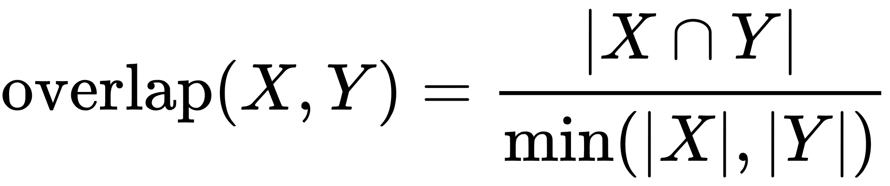

= Category Hierarchy

== Category Hierarchy

This structure between categories is already hiding in the data, we just need to extract it.
The Overlap Similarity algorithm is the perfect choice for this type of problem.

[quote]
____
The overlap coefficient, or Szymkiewicz–Simpson coefficient, is a similarity measure that measures the overlap between two sets.
It is defined as the size of the intersection divided by the smaller of the size of the two sets:
____

It is computed using the following formula:

If set X is a subset of Y or vice versa then the overlap coefficient is equal to one.

== Running the algorithm on dummy data

We want to compute the similarity of categories based on the same businesses being tagged with that category.
Let's see how the algorithm works with some dummy data.

[source, cypher]
----
WITH [
  {item: 1, categories: [10,11,12]},
  {item: 2, categories: [10,11]},
  {item: 3, categories: [11,12,13,14,15]}
] AS data
CALL algo.similarity.overlap.stream(data)
YIELD item1, item2, similarity
RETURN item1, item2, similarity
----

== Running the algorithm on real data

Now let's run the algorithm:

[source,cypher]
----
include::queries.cql[tag=compute-taxonomy-template]
----

== Answer: Running the algorithm on real data

And this is the answer:

[source,cypher]
----
include::queries.cql[tag=compute-taxonomy]
----

== Remove transitive relationships

The algorithm will create relationships between nodes that aren't strictly adjacent in the hierarchy.
Let's remove those transitive relationships by running the following query:

[source,cypher]
----
include::queries.cql[tag=transitive-taxonomy]
----

Now that we've computed relationships between categories, let's go back to the CodeSandbox and update the application to only return top level categories.

NOTE: Top level categories don't have an outgoing `NARROWER_THAN` relationship.
